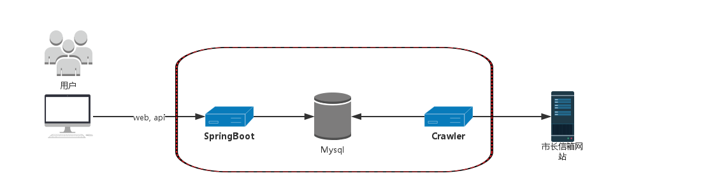
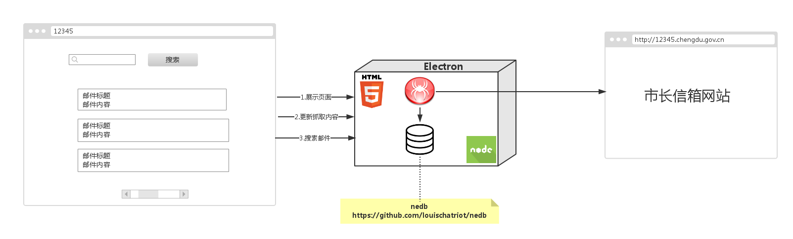
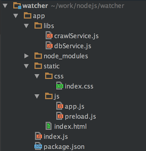

### Run
```
$ npm install && npm start
```
### Build
```
$ npm run build
```


# 使用Electron构建跨平台的抓取桌面程序

谈起桌面应用开发技术, 我们会想到.Net下的WinForm, Java下的JavaFX以及Linux下的QT. 这些技术对于Web应用程序员来说一般比较陌生, 因为大多Web应用程序员的开发技能是前端的JavaScript和后端的Java,PHP等语言.  
如果Web应用程序员想开发桌面应用怎么办? 主流的桌面应用开发技术的学习曲线不低, 上手比较困难. 而Electron的出现给Web应用程序员带来了福音.

Electron简介:
> Electron 是 Github 发布跨平台桌面应用开发工具，支持 Web 技术开发桌面应用开发，其本身是基于 C++ 开发的，GUI 核心来自于 Chrome，而 JavaScript 引擎使用 v8...

简单的说, Electron平台就是用Javascript把UI和后台逻辑打通, 后台主进程使用NodeJs丰富的API完成复杂耗时的逻辑, 而UI进程则借助Chrome渲染html完成交互.  

我之前使用SpringBoot开发了一套[市长信箱抓取Web应用][1]. 由于没服务器部署, 所以我现在想把同样的功能移植到桌面端, 作成一个桌面应用. 对于开发平台我有以下需求:   
1. 能利用我现有的技术栈: Web前端JavaScript, 服务端的Java或者NodeJs.
2. 能跨平台, 既能编译成Mac下的DMG安装程序,又能编译成windows平台下的exe文件, 满足不足场景的使用.

而Electron作为开发平台正好能满足我的这些需求, 通过一天的摸索, 我完成了这个桌面应用, 并最终打包出Mac平台下的DMG安装文件.


下面将介绍我是如何使用Electron平台开发这个桌面应用.

### 回顾: 市长信箱邮件抓取Web应用
动手之前, 我先分析一下之前所做的抓取Web应用. 它的架构如下:

应用分可为四部分:
1. 抓取程序:使用Java的OkHttp作为Http请求类库获取网页内容,并交给Jsoup进行解析, 得到邮件内容.
2. 数据库:用Mysql实现, 用来保存抓取后的网页内容, 并提供检索查询服务.
3. 静态交互页面:一个简单的HTML页面, 使用jQuery发起ajax与后端交互, 并使用handlebar作为展示模板.
4. 通信: 使用SpringBoot提供了交互所需的API(搜索服务,全量抓取和更新邮件).

### 设计: 使用Electron构建抓取桌面应用
将要实现的桌面应用, 同样也需要需要完成这四部分的工作. 我做了以下设计:  
   
Electron主进程借助NodeJs丰富的生态系统完成网页抓取与数据存储与搜索的功能, UI进程则完成页面的渲染工作.

1. 抓取程序: 使用NodeJs的[Request][2], [cheerio][3], [async][4]完成.
2. 数据库: 使用NodeJs下的[nedb][5]存储, 作为应用内嵌数据库可以方便的集成进桌面应用.
3. UI: 使用HTML与前端JavaScript类库完成, 重用之前Web应用中的静态页面.
4. 通信: 使用Electron提供的IPC,完成主进程与UI进程的通信.   

### 实现: 使用Electron构建抓取桌面应用

#### 1. 抓取程序的实现:
市长信箱邮件多达上万封, JavaScript异步的特点, 会让人不小心就写出上千并发请求的程序, 短时间内大量试图和抓取目标服务器建立连接的行为会被服务器拒绝服务, 从而造成抓取流程失败. 所以抓取程序要做到:   
1. tcp连接复用  
2. 并发频率可控  

我使用以下三个NodeJs组件:  
1. [Request][2]: http客户端, 利用了底层NodeJs的Http KeepAlive特性实现了tcp连接的复用.   
2. [async][4]:   控制请求的并发以及异步编程的顺序性.  
3. [cheerio][3]: html的解析器.  

*代码: crawlService.js*  
```JavaScript
//使用request获取页面内容
request('http://12345.chengdu.gov.cn/moreMail', (err, response, body) => {
    if (err) throw err;
    //使用cheerio解析html
    var $ = cheerio.load(body),
        totalSize = $('div.pages script').html().match(/iRecCount = \d+/g)[0].match(/\d+/g)[0];
    ......
    //使用async控制请求并发, 顺序的抓取邮件分页内容
    async.eachSeries(pagesCollection, function (page, crawlNextPage) {
        pageCrawl(page, totalPageSize, updater, crawlNextPage);
    })
});
```

#### 2. 数据库的实现:
抓取后的内容存储方式有较多选择:  
1. 文本文件
2. 搜索引擎
3. 数据库  

文本文件虽然保存简单, 但不利于查询和搜索, 顾不采用.  
搜索引擎一般需要独立部署, 不利于桌面应用的安装, 这里暂不采用.  
独立部署的数据库有和搜索引擎同样的问题, 所以像连接外部Mysql的方式这里也不采用.

 综合考虑, 我需要一种内嵌数据库. 幸好NodeJs的组件非常丰富, [nedb][5]是一个不错的方案, 它可以将数据同时保存在内存和磁盘中, 同时是文档型内嵌数据库, 使用mongodb的语法进行数据操作.  
*代码: dbService.js*  
```JavaScript
//建立数据库连接
const db = new Datastore({filename: getUserHome()+'/.electronapp/watcher/12345mails.db', autoload: true});
......
//使用nedb插入数据
db.update({_id: mail._id}, mail, {upsert: true}, function (err, newDoc) {});
......
//使用nedb进行邮件查询
let match = {$regex: eval('/' + keyword + '/')}; //关键字匹配
var query = keyword ? {$or: [{title: match}, {content: match}]} : {};
db.find(query).sort({publishDate: -1}).limit(100).exec(function (err, mails) {
    event.sender.send('search-reply', {mails: mails});//处理查询结果
});
```
#### 3. UI的实现:
桌面应用的工程目录如图:  
  
我将UI页面放到static文件夹下. 在Electron的进行前端UI开发和普通的Web开发方式一样, 因为Electron的UI进程就是一个Chrome进程. Electron启动时, 主进程会执行index.js文件, index.js将初始化应用的窗口, 设置大小, 并在窗口加载UI入口页面index.html.  
*代码:index.js*  
```JavaScript
function createMainWindow() {
    const win = new electron.BrowserWindow({
        width: 1200,
        height: 800
    });//初始应用窗口大小
    win.loadURL(`file://${__dirname}/static/index.html`);//在窗口中加载页面
    win.openDevTools();//打开chrome的devTools
    win.on('closed', onClosed);
    return win;
}
```
在UI页面开发的过程中, 有一点需要注意的是: 默认情况下页面会出现jQuery, require等组件加载失败的情况, 这是因为浏览器window加载了NodeJs的一些方法, 和jQuery类库的方法冲突. 所以我们需要做些特别的处理, 在浏览器window中把这些NodeJs的方法删掉:  
*代码:preload.js*  
```JavaScript
// 解决require冲突导致jQuery等组件不可用的问题
window.nodeRequire = require;
delete window.require;
delete window.exports;
delete window.module;
// 解决chrome调试工具devtron不可用的问题
window.__devtron = {require: nodeRequire, process: process}
```
#### 4. 通信的实现:
在Web应用中, 页面和服务的通信都是通过ajax进行, 那我们的桌面应用不是也可以采用ajax的方式通信? 这样理论虽然上可行, 但有一个很大弊端: 我们的应用需要打开一个http的监听端口, 通常个人操作系统都禁止软件打开http80端口, 而打开其他端口也容易和别的程序造成端口冲突, 所以我们需要一种更优雅的方式进行通信.  
Electron提供了UI进程和主进程通信的**IPC** API, 通过使用**IPC**通信, 我们就能实现UI页面向NodeJs服务逻辑发起查询和抓取请求,也能实现NodeJs服务主动向UI页面通知抓取进度的更新.  
使用Electron的**IPC**非常简单.   
首先, 我们需要在UI中使用ipcRenderer, 向自定义的channel发出消息.
*代码: app.js*  
```JavaScript
const ipcRenderer = nodeRequire('electron').ipcRenderer;

//提交查询表单
$('form.searchForm').submit(function (event) {
    $('#waitModal').modal('show');
    event.preventDefault();
    ipcRenderer.send('search-keyword', $('input.keyword').val());//发起查询请求
});
ipcRenderer.on('search-reply', function(event, data) {//监听查询结果
    $('#waitModal').modal('hide');
    if (data.mails) {
        var template = Handlebars.compile($('#template').html());
        $('div.list-group').html(template(data));
    }
});
```
然后, 需要在主进程执行的NodeJs代码中使用ipcMain, 监听之前自定义的渠道, 就能接受UI发出的请求了.  
*代码: crawlService.js*
```JavaScript
const ipcMain = require('electron').ipcMain;

ipcMain.on('search-keyword', (event, arg) => {
  ....//处理查询逻辑
});

ipcMain.on('start-crawl', (event, arg) => {
  ....//处理抓取逻辑
});
```
#### 桌面应用打包
解决完以上四个方面的问题后, 剩下的程序写起来就简单了. 程序调试完后, 使用[electron-builder][6], 就可以编译打包出针对不同平台的可执行文件了.

[1]: https://segmentfault.com/a/1190000005183675
[2]: https://github.com/request/request
[3]: https://github.com/cheeriojs/cheerio
[4]: https://github.com/caolan/async
[5]: https://github.com/louischatriot/nedb
[6]: https://github.com/electron-userland/electron-builder
